Eclipse stm32 编辑 编译 下载 调试 （ ST-Link J-Link ） 环境搭建 （使用GNU ARM Eclipse）
=========================

# 说明
传统的IDE功能强大，特别是调试功能，但是如今，其它软件的发展，大家感觉到传统的IDE用户交互、编辑界面、编码效率不够友好；或者为了降低成本，需要使用开源工具 
于是，有人选择使用IDE用来调试，用其它编辑器编码（比如source insight 、sublime text3、notepad++、atom、Eclipse等），来提高效率;或者使用其它的工具链来配合编辑器达到自制一个IDE的效果 
当然还有一些改进得比较好的免费IDE和收费的IDE，比如coocox 
这里是在Eclipse上编写ARM程序 
在Eclipse上编写程序方法： 

> 使用GCC、G++、makefile的方式进行手动编码，一切靠自己 
使用Eclipse+插件（工具链等）的方式来实现 
当然如果不需要编译就直接用啦 

这里是使用GNU ARM Eclipse plug来简化一系列的操作 
GNU ARM Eclipse 是一个插件，会帮助自动生成makefile，管理芯片包（现在使用的Keil的包），提供例示程序，以及提供编译、调试的一个框架，只要再安装一些必要的软件（工具链、build工具（比如make）、调试组件）（安装插件时不会一同安装，需要手动安装）就可以进行编译、调试 
所以主要教程来自于<a target="_blank" href="http://gnuarmeclipse.github.io">GNU ARM Eclipse wiki</a> 建议直接看这个 
下面是安装的时候的笔记

# （一）下载和安装

1. 安装java、配置环境变量
2. <a target="_blank" href="http://www.eclipse.org/downloads">下载Eclipse IDE for C/C++ Developers 环境</a>
3. 解压Eclipse， <a target="_blank" href="http://sourceforge.net/projects/gnuarmeclipse">下载GNU ARM Eclipse Plug-in最新版本</a>   
  * <a href="https://github.com/gnuarmeclipse" target="_blank">github组织地址</a> 
  * <a target="_blank" href="http://gnuarmeclipse.github.io">插件wiki</a>(建议直接看这个，导航在右边)（<a href="http://gnuarmeclipse.github.io/plugins/install/">如何安装插件</a>）
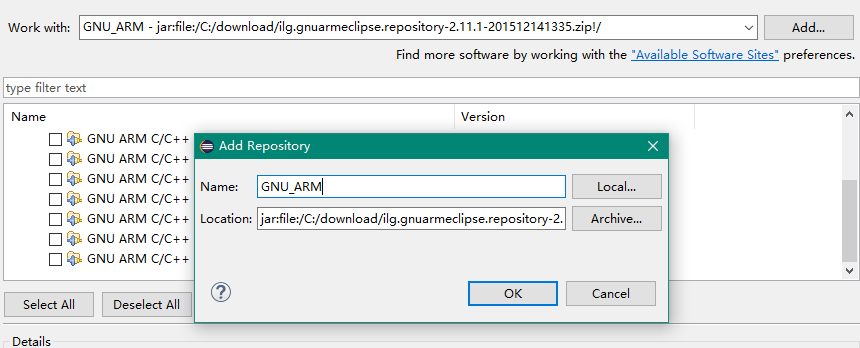
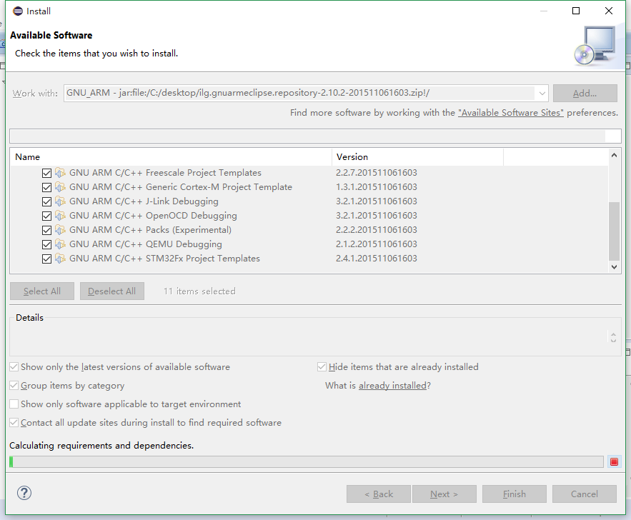

4. 工具链 ，GNU ARM Eclipse Plug-in 插件支持的工具链有很多，如下 
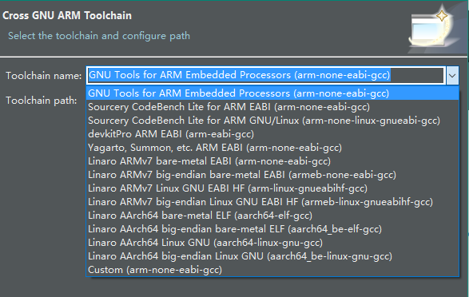 
比如[ GCC ARM Embedded ](https://launchpad.net/gcc-arm-embedded)（[安装教程](http://gnuarmeclipse.github.io/toolchain/install/)）不要设置环境变量！！！！！！不带make，所以用这个还需要下载一个make功能的软件（识别makefile）
 或者 [sourcery g++ lite 的EABI版本](http://www.codesourcery.com/sgpp/lite/arm/portal/subscription?@template=lite) ，不用再下载make，自带，不过名字不是make，是cs-make
5. [安装build工具](http://gnuarmeclipse.github.io/windows-build-tools/install/)（make等）
6. [安装芯片包](http://gnuarmeclipse.github.io/plugins/packs-manager/)
7. [调试器软件安装](http://gnuarmeclipse.github.io/debug/install/)（[J-Link](http://gnuarmeclipse.github.io/debug/jlink/install/)）

# （二）建立工程

1. 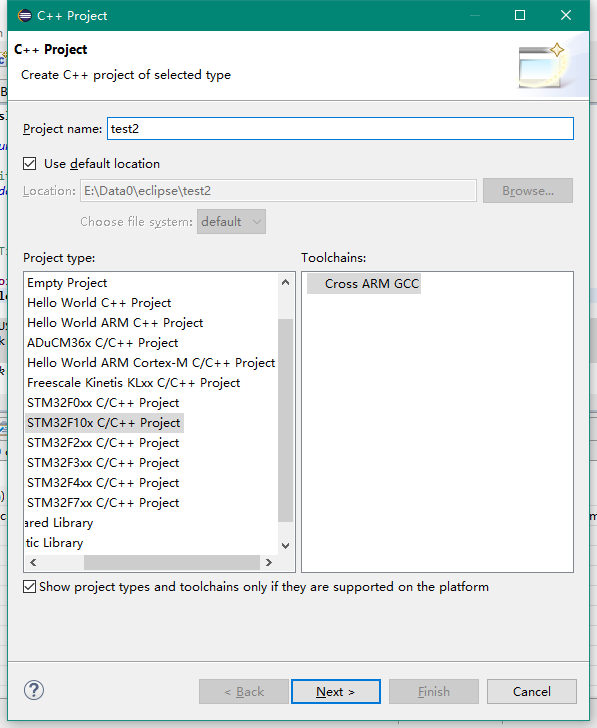
2.  在trace output选择semihosting，就可以在Eclipse的控制台中打印调试信息了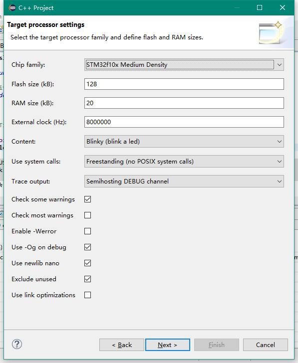
3. 下两步设置工程文件夹等可以默认 
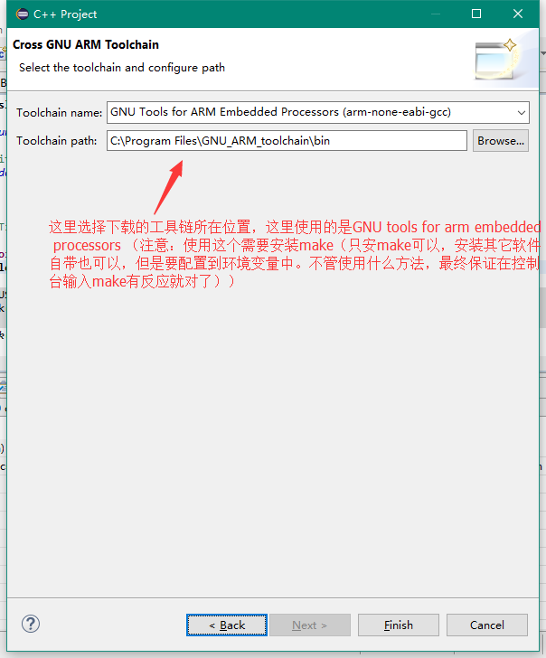
4. 如果遇到找不到make命令或者cs-make命令
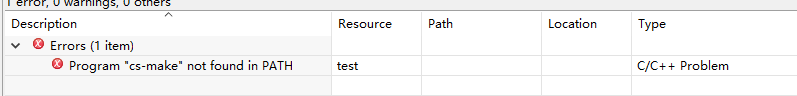
就是没有make程序的原因，或者填错了名称，如果使用sourcery g++ lite EABI，在工程设置（project-->properties-->C++build-->settings）中改成cs-make就行了,如下图
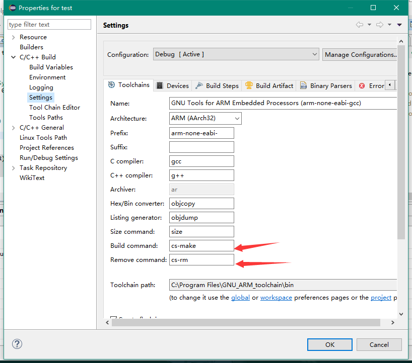
但是如果是使用不带make程序的工具链，要手动安装，方法见（一）中的build tool的安装（或者使用MinGW或Cygwin（初次接触可自行搜索并了解）进行安装
比如cygwin安装这个
）
安装完后可以设置环境变量，最终在控制台输入 make -v 能看到make的版本信息为止（插件官方不推荐）
或者在Eclipse中设置build path，如下图
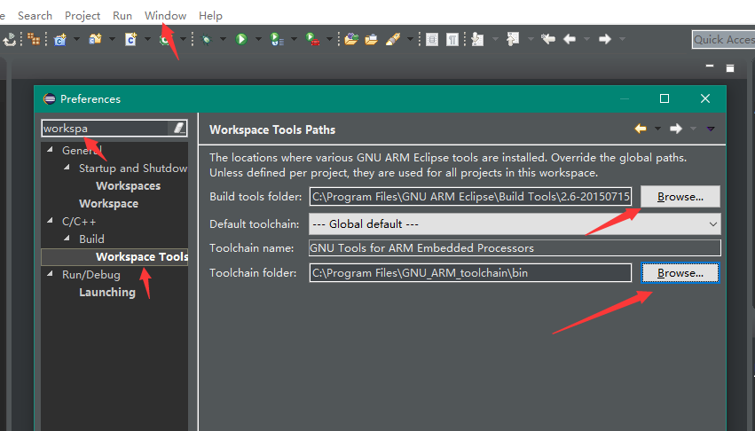
然后进行编译，如果步骤没错，就可以了
5. 工程设置：
 
只链接用到的代码，降低二进制文件大小
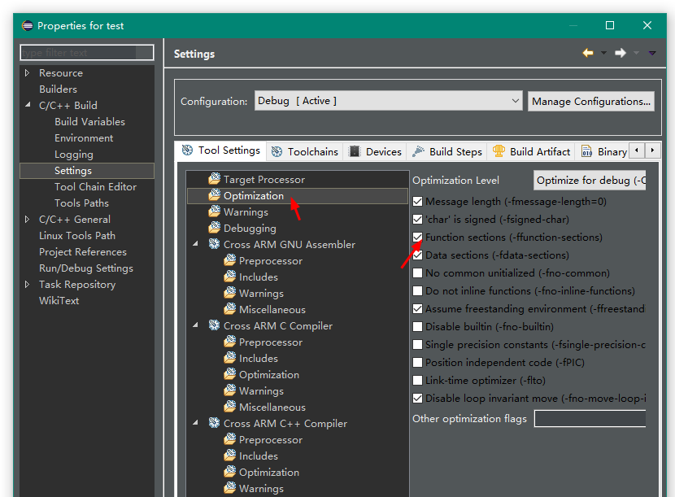
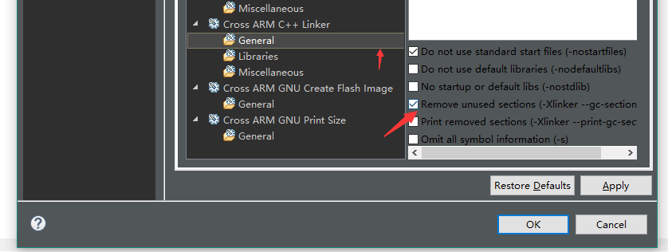

 其它设置，参照模板内的，如果自己建新的空工程

# （三）下载、调试

### ST-Link
* 下载
  * 安装STM32 ST-LINK Utility

	> Windows：官网直接[下载安装](http://www.st.com/web/en/catalog/tools/PF258168)即可 Linux：    需[下载源代码](https://github.com/texane/stlink)自行编译安装 
              
  * 配置下载程序（使用ST-link utility ，只能下载程序，不能调试的方法，使用GDB进行调试的在后面） 
Run-->External tools-->External tools Configurations
然后左上角新建一个配置，按照下图设置 
              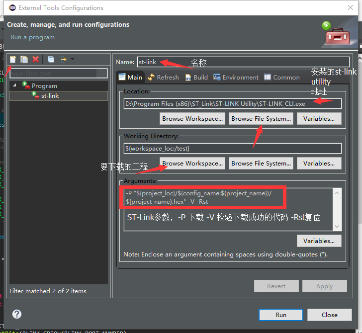
              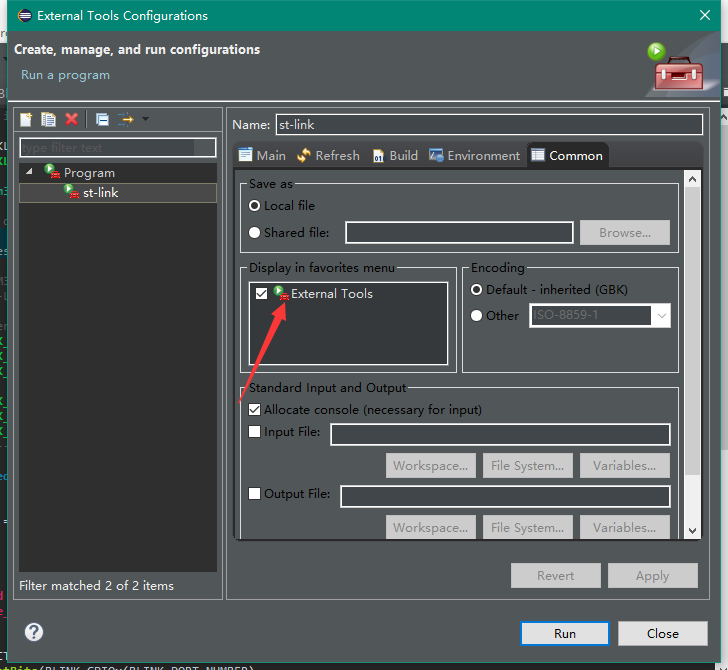
  * 点击这个就可以下载了 
  * 可能会出现这个问 题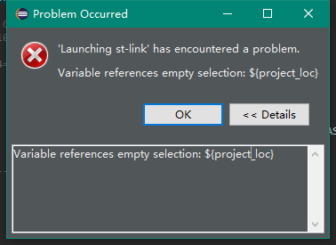
  * 在project-->clean处清理一下工程就行了
  * 这是正在下载 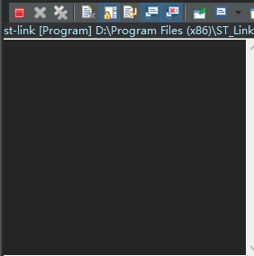 下载完毕 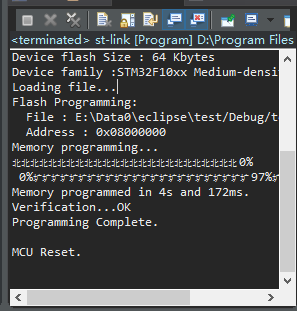

* 调试
  * [下载openocd](http://www.openocd.net/)（[其它地址](http://www.freddiechopin.info/en/download/category/4-openocd)）或者找插件内的（我没找到ㄒoㄒ
  * 然后解压到一个文件夹
  * 选择DebugConfigurations 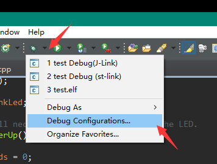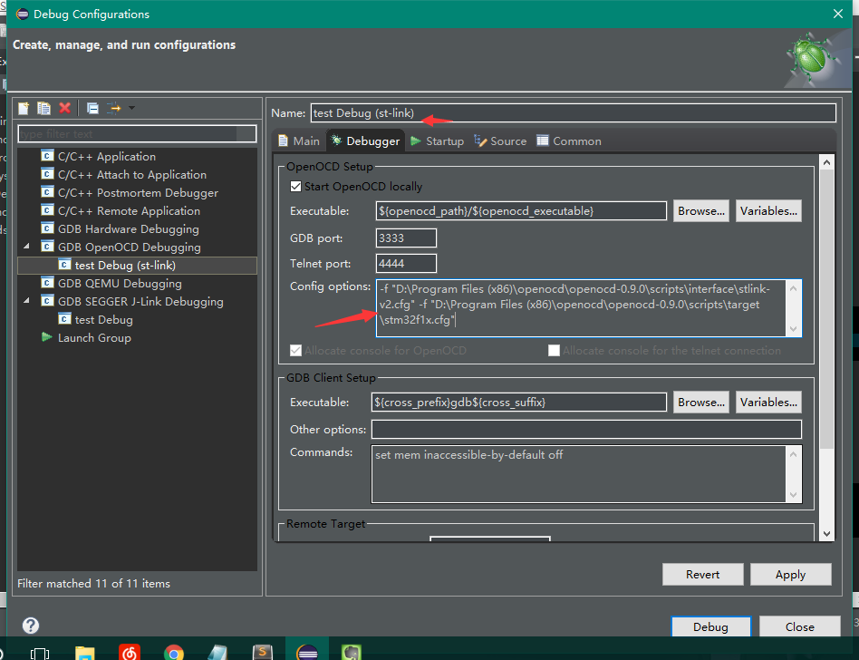

> config options 中的内容来自于openocd文件夹下，根据不同的芯片和st-link版本选择不同的文件，都在同一个文件夹下
Executable中的内容是openocd.exe可执行文件的地址，可以使用变量，如图，或者直接用绝对地址比如D:\Program Files (x86)\openocd\openocd-0.9.0\bin-x64\openocd.exe
Executable中的内容是GDB的位置，使用变量，如图；或者绝对地址如：C:\Program Files\GNU_ARM_toolchain\bin\arm-none-eabi-gdb.exe

  * 如果变量忘记了没关系，有提示，指到前面的文字 
		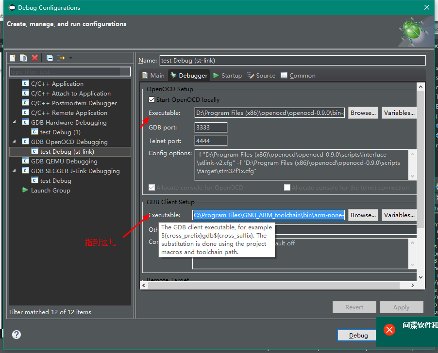
  * 这样st-link调试和下载就基本可以了,效果图 
		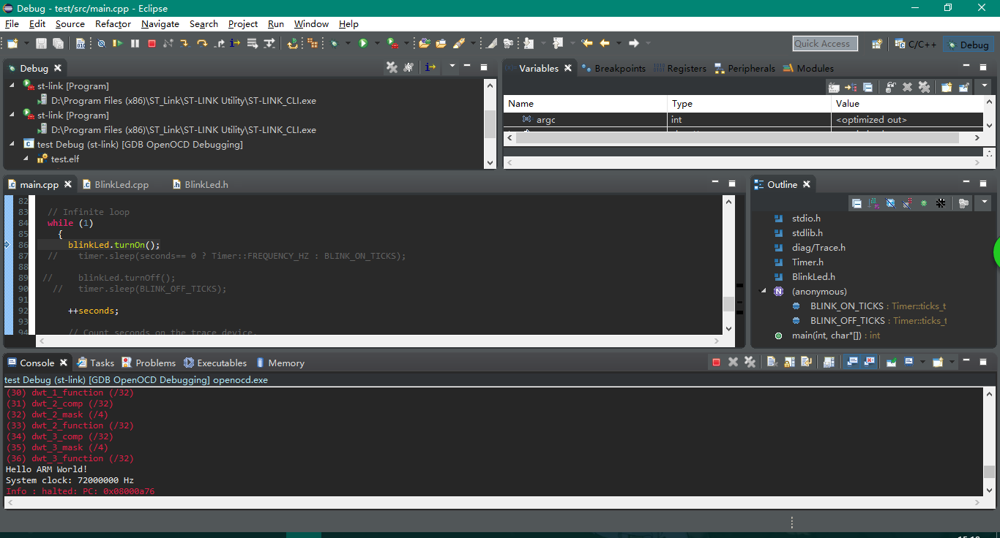
  * 关于寄存器查看，可以安装keil的包（GNU ARM Eclipse插件中含有这个插件，只需要手动更新、下载包就行了），也可以使用插件
 
> ①使用GNU ARM Eclipse中的包管理：  
[使用方法](http://gnuarmeclipse.github.io/plugins/packs-manager/)（可能不好下载，多试几次，我第一天下了好多次不行，第二天就可以了。。。。。） 
效果： 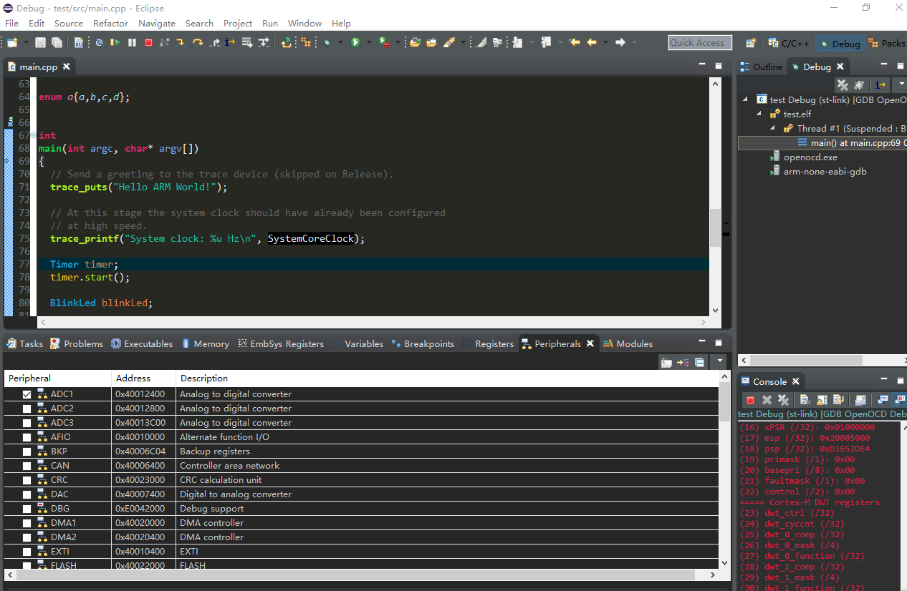 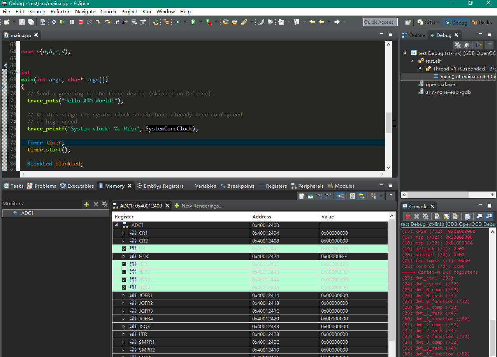  
②使用插件：[插件官网：](http://embsysregview.sourceforge.net/) 
安装： 
Help-->Eclipse marketplace出现下图
搜索embsysregview,然后点击Install。。然后下一步下一步下一步。。。。 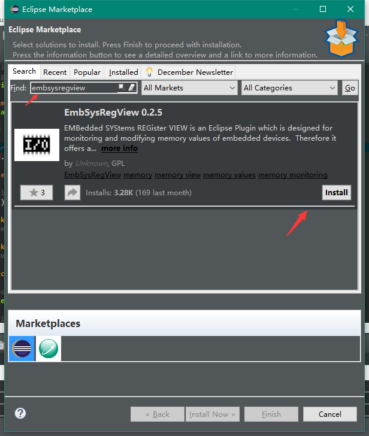

### J-Link

* 方法：

> 1. 似st-link 只是配置文件不同
> 2. 使用JLinkGDBServer

* 参考资料：
  * [GNU ARM Eclipse wiki](http://gnuarmeclipse.github.io/)
  * [J-Link debugging Eclipse plug-in wiki](http://gnuarmeclipse.github.io/debug/jlink/)

* 探索中，出现了问题，已经可以用的可以告知我一下么，谢谢啦

# 其它问题

* enum 找不到。
  * ecplipse中enum成员有时会提示找不到，这是eclipse的bug ， 使用project->C/C++Index -> rebuild 就行了
   
<kbd>[更多文章请到这里](http://blog.neucrack.com)</kbd>
